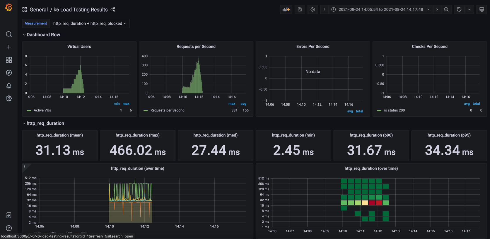

# K6-FOR-STUDIES

Projeto com testes automatizados de **PERFORMANCE**, utilizando o framework: [K6](https://k6.io/)

Utilizado:

- K6

- [Grafana](https://grafana.com/)
- [Influxdb](https://github.com/influxdata/influxdb)

-----------------------

## Contexto

> Index `README`.

- [Pre-requisitos](#pre-requisitos)
- [Configuração](#configuração)
- [Instalação](#instalação)
- [Estrutura](#estrutura)
- [Como Testar](#como-testar)
- [Como visualizar o Report](#como-visualizar-o-report)
  - [Local](#local)
  - [Docker](#docker)
- [Suporte](#suporte)
- [Licença](#licença)

-----------------------

### Pre-requisitos

- [Scoop](https://www.makeuseof.com/windows-install-scoop/)
- [Yarn](https://edca.com.br/blog/instalando-o-nodejs-e-o-yarn-em-4-passos)
- [K6](https://k6.io/)
- [Docker](https://www.docker.com/get-started)
- [VSCode ou outra IDE](https://code.visualstudio.com/download)

-----------------------

### Configuração

> Tips:

Utilizar o **Scoop** ou **Chocolatey** para baixar os packages sinalizados acima.

#### Exemplos

> Yarn:

```bash
choco install yarn
```

> K6:

```bash
choco install k6
```

> Docker:

```bash
choco install docker
```

> Clonar o projeto:

```bash
git clone https://github.com/uLucasFraga/k6_for_studies.git
```

- Usar o terminal para instalar as dependências do **package.json**, por exemplo:

```js
yarn install
```

> IMPORTANTE:

- Para escolher o ambiente a testar:

É necessário a escolha do ambiente através `process.ENV`.

Por exemplo: `env=DEV yarn loadTest` para **DEV** ou `env=LOCAL yarn loadTest` para **LOCAL**.
Se não for inputado nenhum valor, o default é **LOCAL**.

-----------------------

### Instalação

> Limpar o projeto & instalar todas as dependências via **package.json**:

```js
cd /k6-for-studies
yarn clean
yarn install
```

-----------------------

### Estrutura

A estrutura do repositório segue a arquitetura abaixo:

📦k6-for-studies  
┣ 📂dashboards  
┃ ┗ 📜k6-load-testing-results.json  
┣ 📂docs  
┃ ┗ 📂img  
┃ ┃ ┗ 📜img.png  
┣ 📂src  
┃ ┣ 📂requests  
┃ ┃ ┗ 📜users.request.js  
┃ ┣ 📂simulations  
┃ ┃ ┗ 📜fullFlowLoad.test.js  
┃ ┃ ┗ 📜fullFlowStress.test.js  
┃ ┣ 📂utils  
┃ ┃  ┗ 📜utils.js  
┣ 📜.babelrc  
┣ 📜.dockerignore  
┣ 📜.gitignore  
┣ 📜docker-compose.yml  
┣ 📜grafana-dashboard.yaml  
┣ 📜grafana-datasource.yaml  
┣ 📜LICENSE  
┣ 📜package.json  
┣ 📜README.md  
┣ 📜webpack.config.js  
┣ 📜yarn-lock

-----------------------

### Como Testar

Após confirmar as configurações anteriores, seguir os passos abaixo:

#### Local

*IMPORTANTE*: Os testes rodando localmente, não é gerado report no grafana.

> Para rodar os testes de Load com o yarn:

```js
yarn loadTest
```

> Para rodar os testes de Load sem o yarn:

```js
k6 run -e env=LOCAL src/simulations/fullFlowLoad.test.js
```

> Para rodar os testes de Stress com o yarn:

```js
yarn stressTest
```

> Para rodar os testes de Stress sem o yarn:

```js
k6 run -e env=LOCAL src/simulations/fullFlowStress.test.js
```

#### Docker

> Para rodar os testes de Load com o yarn:

```js
yarn docker:up
yarn docker:loadTest
yarn docker:down
```

> Para rodar os testes de Stress sem o yarn:

```js
docker-compose up -d influxdb grafana && docker-compose run k6 run -e env=LOCAL ./src/simulations/fullFlowStress.test.js
```

### Como visualizar o Report

*IMPORTANTE*: Os testes via *docker* será gerado um dashboard no grafana: [Dashboard do Grafana](http://localhost:3200/d/k6/k6-load-testing-results?orgId=1&refresh=5s)

Exemplo de dados gerados no Grafana: 

-----------------------

### Suporte

- contato:

<ulucasfraga@gmail.com>

-----------------------

### Licença

[](http://badges.mit-license.org)

- **[MIT license](http://opensource.org/licenses/mit-license.php)**
- Copyright 2023 © <a href="https://www.linkedin.com/in/ulucasfraga/" target="_blank">Lucas Fraga - Linkedin</a>
